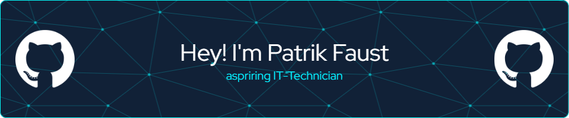

## Hi there i'm Patrik Faust ✋
### A passionate IT-Technician from Germany wanting to learn new things! 

 \
💻 I'm currently working on: Excel automation, Interface for WiFi-Card informations in C#\
🧠 I'm currently learning: Python, C#, Linux

___
### Github Stats
 
___
### My Codewars Account

___
